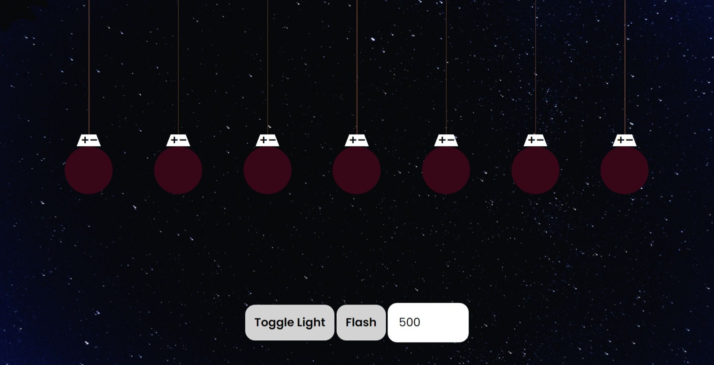
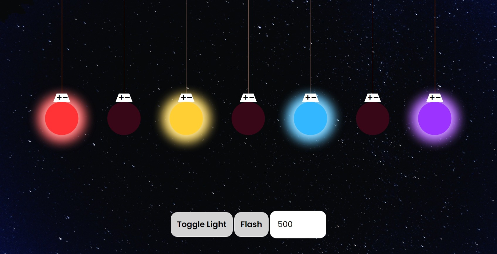

### Features

- User can click to toggle light

- User can make like flash, and also turn off them in the toggle button

### Continue Dev

I try to make all the bonus feature from this but I think I lack of some concept about JS so I will come back and do this

Bonus Feature: [Link](https://github.com/florinpop17/app-ideas/blob/master/Projects/1-Beginner/Christmas-Lights-App.md);

### Screenshots

